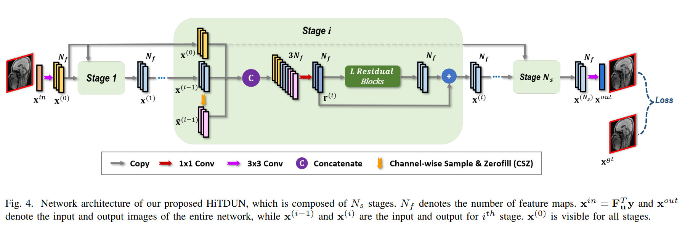
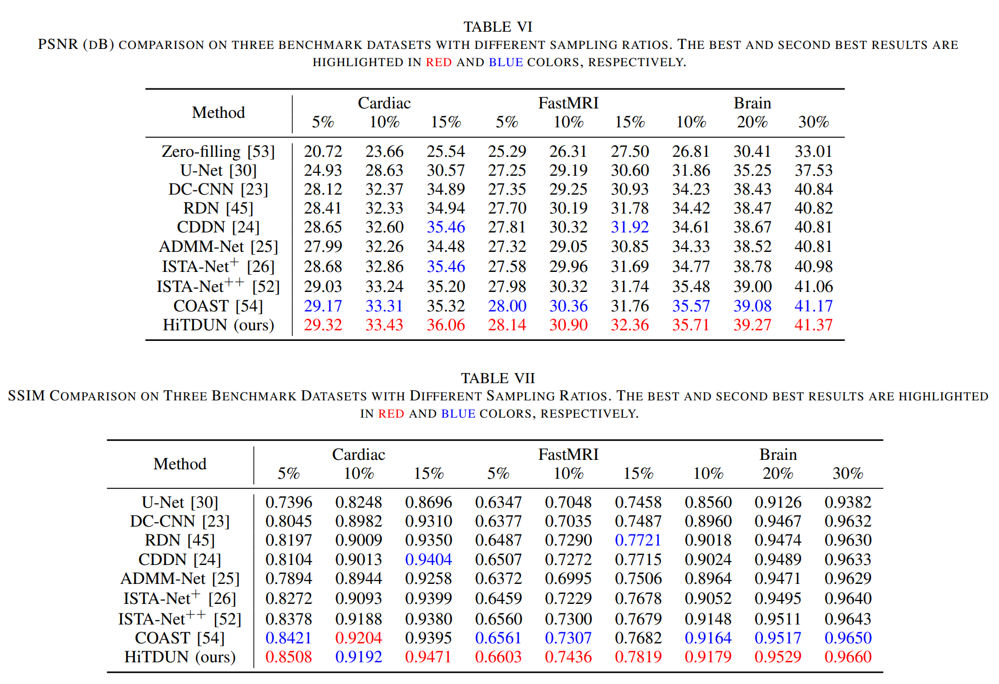
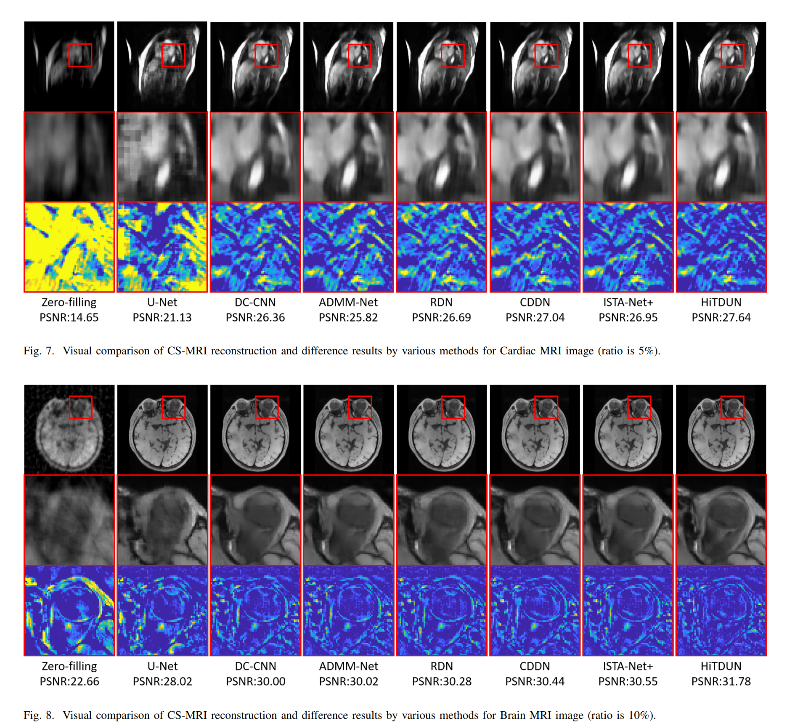
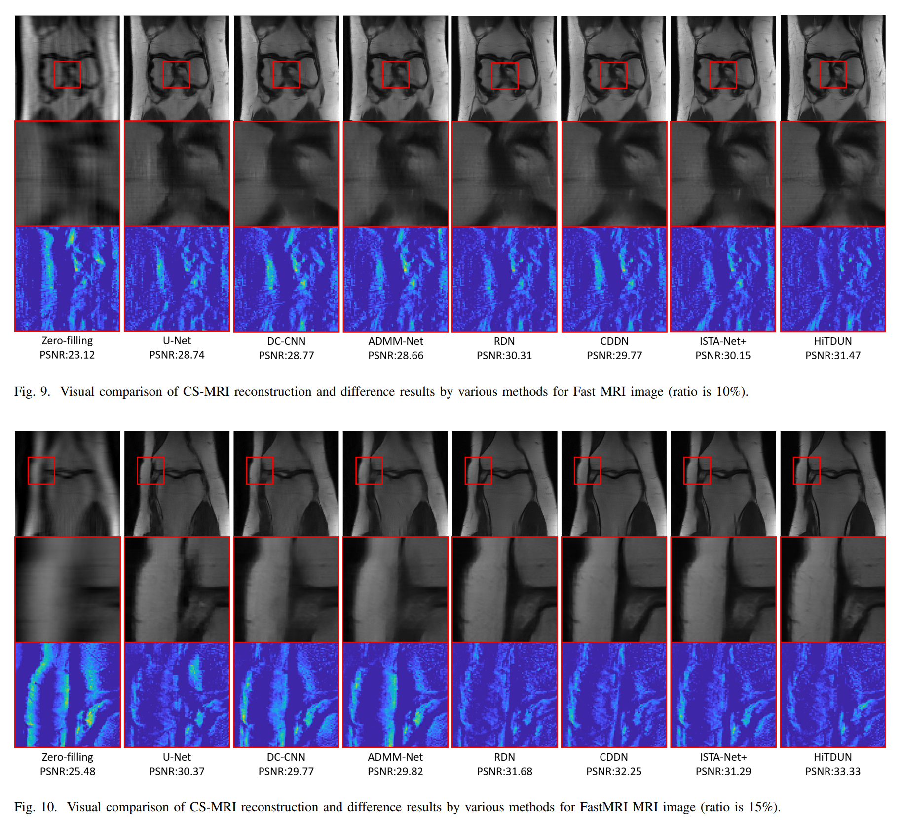

# HiTDUN
This repo is the official PyTroch implementation for 
Jian Zhang, Zhenyu Zhang, Jingfen Xie, Yongbing Zhang. "High-Throughput Deep Unfolding Network for Compressive Sensing MRI". *IEEE Journal of Selected Topics in Signal Processing.* [PDF](https://ieeexplore.ieee.org/document/9763318)  
The code is built on PyTorch and tested on Ubuntu 20.04 environment (Python 3.8, PyTorch 1.10) with NVIDIA Tesla V100 GPU.

## Introduction

Deep unfolding network (DUN) has become the mainstream for compressive sensing MRI (CS-MRI) due to its good interpretability and high performance. Different optimization algorithms are usually unfolded into deep networks with different architectures, in which one iteration corresponds to one stage of DUN. However, there are few works discussing the following two questions: Which optimization algorithm is better after being unfolded into a DUN What are the bottlenecks in existing DUNs This paper attempts to answer these questions and give a feasible solution. For the first question, we empirically verify that two typical DUNs for CS-MRI, which are unfolded by alternating iterative shrinkage-thresholding algorithm (ISTA) and alternating direction method of multipliers (ADMM), actually exhibit a similar representation capability. For the second question, we point out that one major bottleneck of existing DUNs is that the input and output of each stage are just images of one channel, which greatly limits the transmission of network information. To break the information bottleneck, this paper proposes a novel, simple yet powerful high-throughput deep unfolding network (HiTDUN), which is not constrained by any optimization algorithm and can transmit multi-channel information between adjacent network stages. The developed multi-channel fusion strategy can also be easily incorporated into existing DUNs to further boost their performance. Extensive CS-MRI experiments on three benchmark datasets demonstrate that the proposed HiTDUN outperforms existing state-of-the-art DUNs by large margins while maintaining fast computational speed.

Figure 1. Illustration of the proposed PUERT framework.

## Test
Coming soon.

## Train
Coming soon.

## Results

### Quantitative Results

### Visual Results

## Citation

## Acknowledgements
